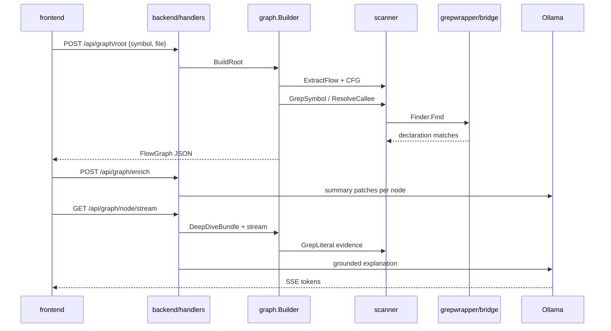

# OnBober codebase guide

A quick orientation for anyone opening the repo for the first time.

## What this project does

OnBober helps developers onboard to unfamiliar codebases:

1. **Pick a symbol** (function, method, class) from a file
2. **See an execution-flow graph** built from source scans (not LLM guesses)
3. **Expand branches** lazily when you need more detail
4. **Read step explanations** with optional LLM deep-dives grounded in repo evidence

The UI lives in `frontend/`. The API and scanners live in `backend/`. Symbol search uses Jack's `grepwrapper/` module via a thin adapter.

---

## Repository layout

```
IBMHackathon/
├── frontend/              Vue 3 + Vite workspace UI
├── backend/               Go HTTP API (module: github.com/ibmhackathon/onbober)
├── grepwrapper/           Jack's ripgrep symbol finder (module: grepwrapper, git subtree)
├── go.work                Links backend + grepwrapper for local dev
└── docs/                  You are here
```

| Doc | Audience | Purpose |
|-----|----------|---------|
| [STARTUP.md](STARTUP.md) | Everyone | Install, run, troubleshoot |
| [CODEBASE.md](CODEBASE.md) | New contributors | Architecture and file tour |
| [GREPWRAPPER.md](GREPWRAPPER.md) | Backend devs | How symbol search fits into OnBober |
| [GREPWRAPPER_SYNC.md](GREPWRAPPER_SYNC.md) | Jack + maintainers | Git subtree sync with `grepWrapper` branch |

---

## Request flow (happy path)



---

## Backend (`backend/`)

Entry point: [`cmd/api/main.go`](../backend/cmd/api/main.go) — registers routes and starts `:8080`.

| Package | Path | Responsibility |
|---------|------|----------------|
| **handlers** | `internal/handlers/` | HTTP handlers, SSE streaming, request parsing |
| **graph** | `internal/graph/` | Flow graphs: CFG builder, enrich, deep dive, node detail |
| **scanner** | `internal/scanner/` | Filesystem, tree listing, **symbol grep adapter**, callee resolution |
| **scanner/flow** | `internal/scanner/flow/` | Hybrid regex + tree-sitter step extraction |
| **llm** | `internal/llm/` | Ollama client, graph/enrich/deep-dive prompts |
| **workspace** | `internal/workspace/` | Clone/upload/register user codebases |

See [`backend/README.md`](../backend/README.md) for a longer backend tour.

### Graph pipeline (scan-first)

1. **`flow.ExtractFlow`** — deterministic steps from source (entry, calls, branches, returns)
2. **`BuildCFGGraph`** — nodes + edges for the symbol
3. **`AttachCalleeHints`** — ripgrep finds callee definitions for expandable call nodes
4. **`POST /api/graph/enrich`** — LLM adds human summaries (async, optional)
5. **Deep dive on demand** — `buildDeepDiveBundle` gathers evidence; LLM explains one step

Topology always comes from scans. LLM only labels and explains.

---

## Frontend (`frontend/`)

| Area | Path | Notes |
|------|------|-------|
| Workspace shell | `src/views/WorkspaceView.vue` | Explorer + flow canvas layout |
| Flow UI | `src/components/workspace/FlowCanvas.vue` | Graph, steps panel, details, deep dive |
| Graph state | `src/composables/useFlowGraph.ts` | Fetch root/expand/enrich |
| Node detail | `src/composables/useNodeDetail.ts` | SSE stream for explanations |

Vite proxies `/api` → `http://localhost:8080` in dev ([`vite.config.ts`](../frontend/vite.config.ts)).

---

## grepwrapper integration (short version)

OnBober does **not** shell out to the `grepwrapper` CLI during normal API requests. The backend imports [`grepwrapper/bridge`](../grepwrapper/bridge/bridge.go) and calls `Finder.Find` in-process.

- **Jack's code** — `grepwrapper/internal/search`, `internal/source`, CLI under `grepwrapper/cmd/`
- **OnBober glue** — `backend/internal/scanner/grepwrapper_adapter.go`
- **Why `bridge/`?** — Go forbids importing another module's `internal/` packages

Full write-up: [GREPWRAPPER.md](GREPWRAPPER.md).

---

## Where to change things

| I want to… | Start here |
|------------|------------|
| Fix flow graph shape / CFG | `backend/internal/graph/cfg.go`, `scanner/flow/` |
| Improve symbol search / C kernel defs | `grepwrapper/internal/search/` (coordinate with Jack) or adapter in `grepwrapper_adapter.go` |
| Change deep-dive prompts / validation | `backend/internal/llm/node_detail_prompt.go`, `graph/deep_dive_context.go`, `graph/parse.go` |
| Add API endpoint | `backend/internal/handlers/`, register in `cmd/api/main.go` |
| UI layout / panels | `frontend/src/components/workspace/`, `useWorkspaceLayout.ts` |
| Pull Jack's latest grepwrapper | [GREPWRAPPER_SYNC.md](GREPWRAPPER_SYNC.md) |

---

## Tests

```powershell
cd grepwrapper && go test ./...
cd ../backend && go test ./...
cd ../frontend && npm run test
```

---

## Conventions

- **Go modules:** `backend` and `grepwrapper` are separate modules joined by `go.work` at repo root.
- **Don't edit** `grepwrapper/internal/*` for OnBober-only features — use the adapter or `grepwrapper/bridge/`.
- **LLM offline:** graphs still render; enrich/deep-dive fall back to scan-based text.
- **IBM Bob / Watsonx:** not wired in this branch; Jack's agentic work stays on `grepWrapper-agentic`.
