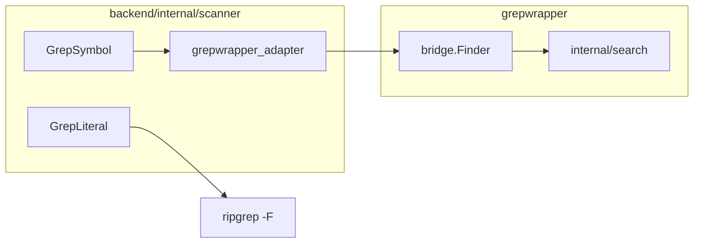

# grepwrapper in OnBober

This doc explains **how symbol search works inside OnBober** — for backend contributors and anyone debugging callee resolution or deep-dive evidence.

For syncing Jack's standalone `grepWrapper` git branch, see [GREPWRAPPER_SYNC.md](GREPWRAPPER_SYNC.md).

---

## Two modules, one workspace

```
grepwrapper/          Jack's repo (git subtree from origin/grepWrapper)
  internal/search/    Language-aware ripgrep patterns
  internal/source/    Safe file reads + line context
  cmd/grepwrapper/    Standalone CLI (debugging)
  bridge/             Public API for other Go modules

backend/
  internal/scanner/
    grepwrapper_adapter.go   OnBober → bridge → search
    grep.go                    GrepSymbol / GrepSymbolLang entrypoints
    grep_literal.go            Fixed-string ripgrep (OnBober-only, deep dive)
```

`go.work` at the repo root tells Go to build both modules together during development.

---

## What grepwrapper provides

Jack's `search.Finder` finds **likely function/method declarations** using ripgrep with per-language regex and file globs:

| Language | Example glob | Finds |
|----------|--------------|-------|
| `c` | `*.c`, `*.h` | `void start_kernel(void)` |
| `go` | `*.go` | `func ParseConfig(...)` |
| `python` | `*.py` | `def provider_name(...)` |
| `javascript` / `typescript` | `*.js`, `*.ts`, … | `function foo`, arrow fns, methods |

Supported `-lang` values: `auto`, `go`, `python`, `javascript`, `typescript`, `rust`, `java`, `c`, `cpp`, `csharp`.

OnBober picks the language from the active file extension (`LanguageFromPath` in `callees.go`) or uses `auto`.

---

## How OnBober calls it



### Symbol search (`GrepSymbol`)

Used when:

- Resolving **callee definitions** for expandable call nodes (`ResolveCallee` → `GrepSymbolLang`)
- Gathering **graph build context** (`builder.gatherContext`)
- Legacy **analyze** endpoint

Flow:

1. Resolve workspace root (path-safe via `SafeJoin`)
2. Infer language from `filePath` when not passed explicitly
3. Call `bridge.Finder.Find` with symbol name, root, language, limit 50
4. Map `Path` → `File`, `Text` → `Content` for OnBober's `Match` type
5. On ripgrep errors, return empty matches (demo mode when `rg` is missing)

### Literal search (`GrepLiteral`)

**Not part of Jack's module.** OnBober uses fixed-string ripgrep for **deep-dive domain evidence** (e.g. grep `"adzuna"` across the workspace). Lives in `grep_literal.go` intentionally — different use case than declaration search.

### Source context (`ReadMatchContext`)

Deep-dive evidence lines can include a few surrounding source lines via `bridge.Reader.ReadContext` (path-safe reads under the workspace root).

---

## Debugging with the CLI

When API behavior is confusing, reproduce search outside OnBober:

```powershell
cd grepwrapper
go run ./cmd/grepwrapper -root C:\path\to\repo -lang c start_kernel
go run ./cmd/grepwrapper -root C:\path\to\repo -lang python -source context -before 3 -after 5 my_func
```

If the CLI finds a symbol but OnBober does not, check:

- Workspace path passed to the API matches `-root`
- File extension → language mapping in `LanguageFromPath`
- Adapter scoping when `filePath` points at a single file

---

## The `bridge` package

Go modules cannot import `grepwrapper/internal/search` from `backend`. The [`bridge/`](../grepwrapper/bridge/) package is the **only supported integration surface**:

- `bridge.NewFinder` / `Finder.Find`
- `bridge.NewReader` / `Reader.ReadContext`

If OnBober needs a new capability from Jack's internals, add a thin export in `bridge/` and coordinate with Jack so it can flow back to his standalone repo.

---

## Ownership boundaries

| Owner | Paths | Changes |
|-------|-------|---------|
| **Jack** | `grepwrapper/internal/*`, `grepwrapper/cmd/*`, his `README` | Symbol search algorithms, CLI, HTTP server stubs |
| **OnBober** | `backend/internal/scanner/grepwrapper_adapter.go`, `grep.go`, `grep_literal.go` | Wiring, soft-fail policy, literal search, deep-dive evidence |
| **Shared** | `grepwrapper/bridge/` | New public APIs — discuss before large changes |

---

## Related reading

- [CODEBASE.md](CODEBASE.md) — full repo tour
- [GREPWRAPPER_SYNC.md](GREPWRAPPER_SYNC.md) — `git subtree pull` for Jack
- [grepwrapper/README.md](../grepwrapper/README.md) — Jack's original project docs
